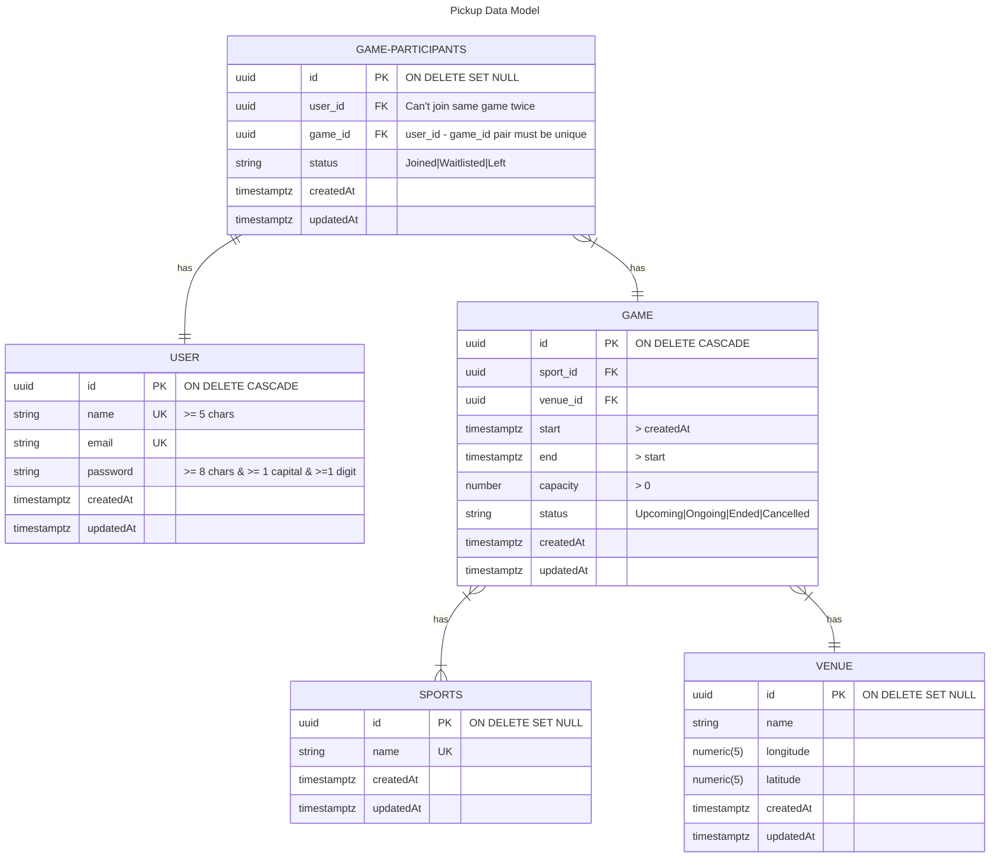

```mermaid
---
title: Pickup Data Model
---
erDiagram
    GAME-PARTICIPANTS ||--|| USER : has
    GAME-PARTICIPANTS }|--|| GAME : has
    GAME }|--|{ SPORTS : has
    GAME }|--|| VENUE : has
    USER {
        uuid id PK "ON DELETE CASCADE"
        string name UK ">= 5 chars"
        string email UK
        string password ">= 8 chars & >= 1 capital & >=1 digit"
        timestamptz createdAt
        timestamptz updatedAt
    }
    GAME-PARTICIPANTS {
        uuid id PK "ON DELETE SET NULL"
        uuid user_id FK "Can't join same game twice"
        uuid game_id FK "user_id - game_id pair must be unique"
        string status "Joined|Waitlisted|Left"
        timestamptz createdAt
        timestamptz updatedAt
    }
    SPORTS {
        uuid id PK "ON DELETE SET NULL"
        string name UK
        timestamptz createdAt
        timestamptz updatedAt
    }
    VENUE {
        uuid id PK "ON DELETE SET NULL"
        string name
        numeric(5) longitude
        numeric(5) latitude
        timestamptz createdAt
        timestamptz updatedAt
    }
    GAME {
        uuid id PK "ON DELETE CASCADE"
        uuid sport_id FK
        uuid venue_id FK
        timestamptz start "> createdAt"
        timestamptz end "> start"
        number capacity "> 0"
        string status "Upcoming|Ongoing|Ended|Cancelled"
        timestamptz createdAt
        timestamptz updatedAt
    }
```

## Queries

- Upcoming games - /api/v1/games?status=upcoming
- Games players - /api/v1/games/:id
- My games - /api/v1/user/:id/games
